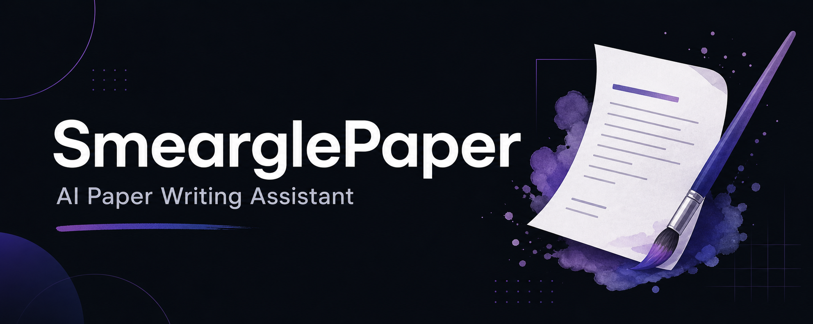

<a name="smearglepaper"></a>
<p align="center">
  
</p>

<p align="center">
  <h1 align="center">🎨 SmearglePaper</h1>
  <p align="center">
    <strong>Automated AI Paper Writing & Publishing Assistant</strong><br>
    <em>Inspired by Pokémon Smeargle — painting papers into readable deep-dives</em>
  </p>
  <p align="center">
    <a href="#-features">Features</a> •
    <a href="#-quick-start">Quick Start</a> •
    <a href="#-installation">Installation</a> •
    <a href="#%EF%B8%8F-cli-commands">CLI Commands</a> •
    <a href="#-mcp-server">MCP Server</a> •
    <a href="#%EF%B8%8F-configuration">Configuration</a>
  </p>
</p>

<p align="center">
  
  
  
  
  
  
</p>

<p align="center">
  <a href="README.md">中文</a> | <strong>English</strong>
</p>

---

## ✨ Features

SmearglePaper converts the latest AI papers into structured Chinese technical article drafts. Inspired by the Pokémon Smeargle, it "paints" papers into readable deep-dive articles.

<table>
  <tr>
    <td width="50%">
      <h3>📄 Paper Collection</h3>
      <ul>
        <li>Collect latest papers from arXiv</li>
        <li>Collect AI engineering blogs via RSS/Atom feeds</li>
        <li>Collect trending projects from GitHub Trending</li>
        <li>Rank by topic relevance, freshness, and AI category signals</li>
      </ul>
    </td>
    <td width="50%">
      <h3>📝 Article Generation</h3>
      <ul>
        <li>Download and parse PDFs with PyMuPDF</li>
        <li>Extract figure candidates</li>
        <li>Generate Chinese deep-dive articles with LLM</li>
        <li>Supports DeepSeek / OpenAI-compatible APIs</li>
      </ul>
    </td>
  </tr>
  <tr>
    <td width="50%">
      <h3>🔍 Quality Review</h3>
      <ul>
        <li>Article quality scoring</li>
        <li>LLM-powered editing and improvement</li>
        <li>Local template fallback (works offline)</li>
        <li>Evidence-first writing workflow</li>
      </ul>
    </td>
    <td width="50%">
      <h3>📱 WeChat Publishing</h3>
      <ul>
        <li>Generate WeChat Official Account–compatible HTML</li>
        <li>Auto-create cover images</li>
        <li>Create / update WeChat drafts</li>
        <li>MCP tool support for AI Agent integration</li>
      </ul>
    </td>
  </tr>
</table>

<div align="right"><a href="#smearglepaper">↑ back to top</a></div>

---

## 🚀 Quick Start

**① One-command full pipeline**

```bash
smearglepaper agent-run --topic agents --days 30 --top-k 5
```

**② Step-by-step**

```bash
smearglepaper preflight                                          # Check environment
smearglepaper collect --topic agents --days 30 --max-results 50 # Collect papers
smearglepaper rank --top-k 5                                     # Rank papers
smearglepaper write --paper-id 2401.00001                        # Generate article
smearglepaper review-article data/articles/2401.00001.md         # Review article
smearglepaper improve-article data/articles/2401.00001.json      # Improve article
```

**③ Deep-read Agent**

```bash
smearglepaper agent "Explain this paper" --paper-url https://arxiv.org/abs/1706.03762
```

<div align="right"><a href="#smearglepaper">↑ back to top</a></div>

---

## 📦 Installation

> **Prerequisites**: Python 3.10+, Conda recommended

**Conda (recommended)**

```bash
conda env create -p ./.conda/envs/smearglepaper -f environment.yml
conda run -p ./.conda/envs/smearglepaper python -m pip install -e ".[dev]"
```

<details>
<summary><strong>📋 Pip installation — click to expand</strong></summary>
<br>

```bash
python -m venv .venv
source .venv/bin/activate   # Windows: .venv\Scripts\activate
python -m pip install -e ".[dev]"
```

</details>

```bash
# Verify installation
smearglepaper preflight
```

<div align="right"><a href="#smearglepaper">↑ back to top</a></div>

---

## 🛠️ CLI Commands

<table>
<tr><th>Command</th><th>Description</th></tr>
<tr><td><code>smearglepaper topics</code></td><td>List available topic presets</td></tr>
<tr><td><code>smearglepaper collect</code></td><td>Collect arXiv papers</td></tr>
<tr><td><code>smearglepaper collect-blogs</code></td><td>Collect AI engineering blogs</td></tr>
<tr><td><code>smearglepaper collect-github</code></td><td>Collect GitHub Trending projects</td></tr>
<tr><td><code>smearglepaper rank</code></td><td>Rank collected papers</td></tr>
<tr><td><code>smearglepaper read</code></td><td>Read a paper</td></tr>
<tr><td><code>smearglepaper write</code></td><td>Generate an article</td></tr>
<tr><td><code>smearglepaper review-article</code></td><td>Review article quality</td></tr>
<tr><td><code>smearglepaper improve-article</code></td><td>Improve article with LLM</td></tr>
<tr><td><code>smearglepaper draft</code></td><td>Create WeChat draft</td></tr>
<tr><td><code>smearglepaper agent-run</code></td><td>Run the full automated pipeline</td></tr>
<tr><td><code>smearglepaper daily-digest</code></td><td>Daily paper digest</td></tr>
<tr><td><code>smearglepaper trend-analysis</code></td><td>Trend analysis</td></tr>
</table>

**Topic presets**: `latest_ai` · `agents` · `nlp` · `nlp_semantics` · `nlp_syntax` · `nlp_pragmatics`

<div align="right"><a href="#smearglepaper">↑ back to top</a></div>

---

## 🔧 MCP Server

SmearglePaper runs as an MCP server for seamless AI Agent integration:

```bash
python -m mcp_server.server
```

<details>
<summary><strong>📋 Available MCP tools — click to expand</strong></summary>
<br>

| Tool | Description |
|------|-------------|
| `collect_papers` | Collect papers |
| `collect_blogs` | Collect blogs |
| `rank_latest` | Rank papers |
| `read_paper` | Read a paper |
| `write_article` | Generate an article |
| `review_article` | Review article quality |
| `improve_article` | Improve article |
| `create_draft` | Create WeChat draft |
| `publish_article` | Publish article |

See [docs/MCP.md](docs/MCP.md) for full documentation.

</details>

<div align="right"><a href="#smearglepaper">↑ back to top</a></div>

---

## ⚙️ Configuration

```bash
cp .env.example .env
```

Edit `.env`:

```bash
# LLM config (required)
OPENAI_BASE_URL=https://api.deepseek.com
OPENAI_API_KEY=your-api-key
OPENAI_MODEL=deepseek-chat

# WeChat Official Account (optional, only needed for publishing)
WECHAT_APP_ID=your-app-id
WECHAT_APP_SECRET=your-app-secret
```

> 💡 Without LLM config, SmearglePaper falls back to local templates — the full workflow is still testable offline.

<div align="right"><a href="#smearglepaper">↑ back to top</a></div>

---

## 📁 Project Structure

```
SmearglePaper/
├── src/
│   ├── smearglepaper/      # Core business logic
│   └── mcp_server/         # MCP server
├── data/
│   ├── papers/             # Collected papers
│   ├── articles/           # Generated articles
│   ├── covers/             # Cover images
│   └── figures/            # Extracted figures
├── workspace/
│   ├── paper_writing/      # Paper writing workspace
│   └── tasks/              # Task management
├── skills/                 # Workflow skills
├── prompts/                # LLM prompts
└── tests/                  # Tests
```

<div align="right"><a href="#smearglepaper">↑ back to top</a></div>

---

## 🧪 Development

<details>
<summary><strong>Dev setup, tests, and debugging — click to expand</strong></summary>
<br>

```bash
# Run tests
python -m pytest -q

# Check environment
python -m smearglepaper preflight

# Test MCP import
python -c 'import mcp_server.server; print("mcp import ok")'
```

</details>

<div align="right"><a href="#smearglepaper">↑ back to top</a></div>

---

## 🤝 Contributing

Contributions are welcome!

1. Fork the repository
2. Create a feature branch (`git checkout -b feature/amazing-feature`)
3. Commit your changes (`git commit -m 'feat: add amazing feature'`)
4. Push to the branch (`git push origin feature/amazing-feature`)
5. Open a Pull Request

<div align="right"><a href="#smearglepaper">↑ back to top</a></div>

---

## 📄 License

MIT License — see [LICENSE](LICENSE) for details.

---

## 🙏 Acknowledgments

- [arXiv](https://arxiv.org/) — Paper source
- [DeepSeek](https://api.deepseek.com/) — LLM API
- [WeChat Official Account API](https://developers.weixin.qq.com/) — Publishing API

---

<p align="center">
  <strong>⭐ If SmearglePaper helped you, consider giving it a Star!</strong>
</p>

<p align="center">
  <a href="https://star-history.com/#GetIT-Sunday/SmearglePaper&Date">
    
  </a>
</p>

<p align="center">
  <sub>Made with ✨ by <a href="https://github.com/GetIT-Sunday">GetIT-Sunday</a> using <a href="https://github.com/GetIT-Sunday/ReadmeMagic-github-readme-design-skill">ReadmeMagic</a></sub>
</p>
